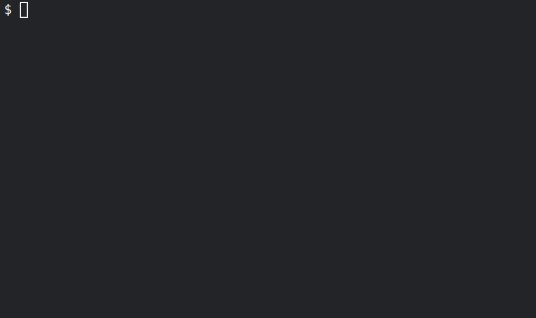

[](https://github.com/get-gah/gah/releases)
[](https://github.com/get-gah/gah/blob/master/LICENSE)
[](#contributors)


`gah` is an GitHub Releases app installer, that **DOES NOT REQUIRE SUDO**! It is a simple bash script that downloads the latest release of an app from GitHub and installs it in `~/.local/bin`. It is designed to be used with apps that are distributed as a single binary file.

## Motivation

Nowadays more and more command-line tools and applications are distributed via GitHub Releases. The installation process looks always the same: you go to the release page, expand assets, find the right file for your platform (which may be very frustrating, especially when there are 200+ assets and very often developers use different naming conventions - e.g. `myapp-linux-amd64`, `myapp_linux_x64`, `myapp-unknown-linux-gnu-x86_64`, etc.), download it, unpack it, move it to `~/.local/bin`, execute `chmod +x` on it and don't forget to clean up afterwards. For me, it was a hassle. Each time I needed to go thru the process again I was doing "gah! not again!". So I thought, why not automate this process? In fact, I love automation and RegExp. And so `gah` was born.

## Features

- 🏷 Downloads the latest or given release of an app from GitHub
- 🎯 Automatically selects matching binary for the current platform

  - Supported OS: Linux and MacOS
  - Supported architectures: x64 and ARM64

- 🎳 Supports multiple matching apps in a single GitHub Release
- 📤 Supports archived (`.zip`, `.tar.gz`, `.tar.bz2`, `.tar.xz`) and single binary releases
- 🗃 Has own base of predefined aliases for GitHub repositories (PRs are welcome!)
- 🔐 Verifies downloaded files using provided by `openssl` against [asset's digest value](https://docs.github.com/en/rest/releases/assets?apiVersion=2022-11-28#get-a-release-asset)

## Requirements

- `bash` (version 3 or higher)
- `perl` (by default installed on most unix systems, required for bash < 4)
- `jq`
- `curl` or `wget`
- `tar` (by default installed on most unix systems)
- `unzip` (by default installed on most unix systems)
- `openssl` (by default installed on most unix systems)

## Installation

```bash
bash -c "$(curl -fsSL https://raw.githubusercontent.com/get-gah/gah/refs/heads/master/tools/install.sh)"
```
or
```bash
bash -c "$(wget -qO- https://raw.githubusercontent.com/get-gah/gah/refs/heads/master/tools/install.sh)"
```

## Usage



Type `gah help` to see the list of available commands.

### Using known aliases

`gah` has a predefined set of aliases for some popular apps. You can use these aliases to install the apps without specifying the full GitHub repository name.
To see the list of available aliases, type `gah aliases show`.

The file `db.json` with aliases is located in [get-gah/gah-db](https://github.com/get-gah/gah-db/blob/master/db.json). Feel free to add your own aliases or suggest new ones by creating a pull request.

> [!NOTE]  
> Previously the database file was located on a separate branch of this repository. Now it is moved to a separate repository to allow independent updates. Please make sure to use the latest version of `gah` to get the new database location.

The file is cached locally for 24h.

### Specifying the tag

You can specify the tag of the release you want to install. If you don't specify a tag, the latest release will be installed.

```bash
gah install getsops/sops --tag=v3.10.2
```

### Unattended mode

`gah` will try to detect if your terminal supports input or not. To force this behavior you can either use the `--unattended` flag or set env var `GAH_UNATTENDED=true` (for backward compatibility `UNATTENDED=true` will also work).
This will skip the confirmation prompt and install the app without asking for any input.

```bash
gah install getsops/sops --unattended
```

or

```bash
export GAH_UNATTENDED=true
gah install getsops/sops
```

#### Selecting download URL in unattended mode

If multiple download URLs match your OS and architecture, you can specify which one to use in unattended mode by providing the `--unattended-select-index` option. The index start from 1, which is also the default value.

```bash
gah install zellij-org/zellij --unattended --unattended-select-index=2
```

### Update gah

```sh
gah update
```

### GitHub API Authentication

By default, `gah` uses unauthenticated GitHub API requests, which are limited to 60 requests per hour. If you frequently install applications or hit rate limits, you can authenticate using a GitHub Personal Access Token (PAT) to increase your rate limit to 5,000 requests per hour.

To set up authentication:

1. Create a Personal Access Token at https://github.com/settings/tokens (no special scopes required for public repositories)
2. Set the `GITHUB_PAT` environment variable:

```bash
export GITHUB_PAT="ghp_your_token_here"
```

When authenticated, `gah` will display a confirmation message: "Using GitHub Personal Access Token for API requests".

If you encounter a rate limit error, `gah` will provide instructions on how to set up authentication.

## Examples

### Install latest version of gh (GitHub CLI)

```bash
gah install gh
```

### Install specific version of argocd

```bash
gah install argocd --tag=v2.0.3
```

### Install an app that is not in the predefined aliases

```bash
gah install hashicorp/vagrant
```

## Configuration

Here is the list of supported environment variables:

Name | Description | Default
---|---|---
`GAH_INSTALL_DIR` | The directory where the gah will install your applications. This directory must be in your `PATH` environment variable. | `~/.local/bin`, for superuser it will be `/usr/local/bin`
`GAH_CACHE_DIR` | The directory where cache will be stored. | `~/.cache/gah`
`GITHUB_PAT` | GitHub Personal Access Token for authenticated API requests. Increases rate limit from 60 to 5,000 requests per hour. Create a token at https://github.com/settings/tokens | None (unauthenticated requests)
`GAH_DEBUG` | Enable debug output showing detailed information about the installation process. | `false`
`GAH_UNATTENDED` | Enable unattended mode, which skips confirmation prompts during installation. | `false`

## Using in GitHub Actions

There is an official GitHub Action to [setup gah](https://github.com/get-gah/setup-gah).

## Contributors

Thanks to all contributors:

<!-- ALL-CONTRIBUTORS-LIST:START - Do not remove or modify this section -->
<!-- prettier-ignore-start -->
<!-- markdownlint-disable -->
<table>
  <tbody>
    <tr>
      <td align="center" valign="top" width="14.28%"><a href="https://github.com/rverenich"><br /><sub><b>Roman Verenich</b></sub></a><br /><a href="#data-rverenich" title="Data">🔣</a></td>
      <td align="center" valign="top" width="14.28%"><a href="https://github.com/LucasCzerny"><br /><sub><b>Lucas</b></sub></a><br /><a href="https://github.com/get-gah/gah/commits?author=LucasCzerny" title="Code">💻</a></td>
      <td align="center" valign="top" width="14.28%"><a href="https://github.com/karlovsek"><br /><sub><b>karlovsek</b></sub></a><br /><a href="https://github.com/get-gah/gah/issues?q=author%3Akarlovsek" title="Bug reports">🐛</a> <a href="https://github.com/get-gah/gah/commits?author=karlovsek" title="Code">💻</a></td>
      <td align="center" valign="top" width="14.28%"><a href="https://github.com/aslak01"><br /><sub><b>aslak01</b></sub></a><br /><a href="https://github.com/get-gah/gah/issues?q=author%3Aaslak01" title="Bug reports">🐛</a></td>
      <td align="center" valign="top" width="14.28%"><a href="https://github.com/aheiska"><br /><sub><b>Anssi Heiska</b></sub></a><br /><a href="https://github.com/get-gah/gah/issues?q=author%3Aaheiska" title="Bug reports">🐛</a></td>
      <td align="center" valign="top" width="14.28%"><a href="https://gh-profile-rishabh-os.vercel.app"><br /><sub><b>Rishabh</b></sub></a><br /><a href="#ideas-rishabh-os" title="Ideas, Planning, & Feedback">🤔</a></td>
      <td align="center" valign="top" width="14.28%"><a href="http://lylebrown.com"><br /><sub><b>Lyle Brown</b></sub></a><br /><a href="#ideas-lylebrown" title="Ideas, Planning, & Feedback">🤔</a></td>
    </tr>
    <tr>
      <td align="center" valign="top" width="14.28%"><a href="https://github.com/danielefranceschi"><br /><sub><b>Daniele Franceschi</b></sub></a><br /><a href="https://github.com/get-gah/gah/commits?author=danielefranceschi" title="Code">💻</a></td>
      <td align="center" valign="top" width="14.28%"><a href="https://github.com/ebb-earl-co"><br /><sub><b>Colin Coe</b></sub></a><br /><a href="#ideas-ebb-earl-co" title="Ideas, Planning, & Feedback">🤔</a></td>
    </tr>
  </tbody>
</table>

<!-- markdownlint-restore -->
<!-- prettier-ignore-end -->

<!-- ALL-CONTRIBUTORS-LIST:END -->

## License

gah is licensed under the Apache-2.0 License. See [LICENSE](./LICENSE) for the full license text.
